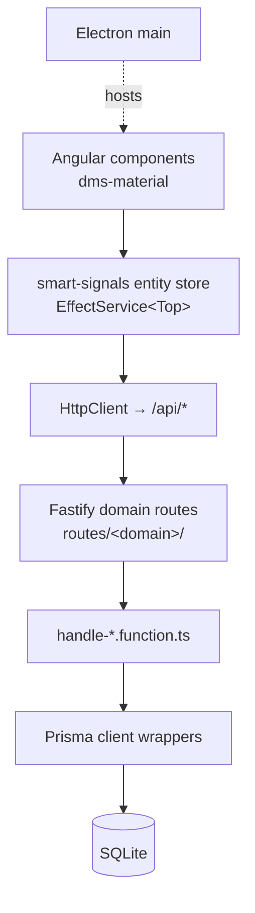

# Architecture Spine — DMS

## Design Paradigm

**Layered domain-driven.** The system is two runtimes behind one browser surface, split by a strict dependency direction: the client never talks to the database, and the database layer never knows about HTTP.

- **`apps/server`** — a Fastify app organized *by domain, not by layer*. Each domain owns a `routes/<domain>/` directory that pairs its route definitions (`index.ts`) with its request handlers (`handle-*.function.ts`) and — where a domain has non-trivial logic — a `services/` file. Domain handlers reach *down* into Prisma (via the shared `prisma/` client wrappers) and *never* reach sideways into another domain's routes.
- **`apps/dms-material`** — an Angular app whose state is a single flat `Top` entity tree held by a `@smarttools/smart-signals` entity store (`EffectService<Top>`). Components are `OnPush` and pull data through store selectors; mutation flows through domain `EffectService` subclasses that POST to the matching `apps/server` domain route.
- **`apps/electron`** — a thin wrapper that hosts `dms-material` against a local `apps/server`; no business logic.

Dependency direction is fixed (a rule, not a preference):



## Invariants & Rules

### AD-1 — Route-domain organization; no cross-domain imports

- **Binds:** FR-1, FR-2, FR-3, FR-4, FR-13, FR-14, FR-18
- **Prevents:** Cross-domain coupling; a domain importing another domain's route internals; tangled handler graphs that break per-domain test isolation.
- **Rule:** Server code is organized by domain, not layer. Each domain owns `routes/<domain>/index.ts` (registration) + `handle-*.function.ts` (handlers) + optional `services/`. A domain handler reaches *down* into Prisma only — never sideways into another domain's routes or handlers.

### AD-2 — Single client state: smart-signals `Top` entity tree

- **Binds:** FR-1, FR-2, FR-15, FR-16
- **Prevents:** A second parallel state tree; components holding their own copy of the tree; store bypass via direct `HttpClient` in components.
- **Rule:** Client state is the flat `Top` entity tree held by a `@smarttools/smart-signals` `EffectService<Top>`. Components are `OnPush`, pull via store selectors, and mutate through the matching domain `EffectService` POSTing to the server route. `Top` is the sole bootstrap source of ID lists (accounts, universes, riskGroups, screens, divDepositTypes, holidays). `current-account` is a plain `@ngrx/signals` store — a scoped *selection* (which account is open), not a second source of truth; do not extend it into a competing aggregate.

### AD-3 — Data layer: Prisma + SQLite, no repository seam [ADOPTED]

- **Binds:** FR-1, FR-2, FR-5, FR-6, FR-10, FR-16, FR-18
- **Prevents:** A parallel data-access abstraction diverging from Prisma; `data-models.md` drifting from the live schema; per-domain schema ownership.
- **Rule:** [ADOPTED] `prisma/schema.prisma` is the single source of truth for the data model (overrides `data-models.md` where they disagree). Domain handlers call the shared Prisma client (via the `prisma/` client wrappers) directly — there is no repository/service seam, and one is not introduced. The `services/` dir holds *operational* concerns only (database performance monitoring, audit logging, CUSIP-cache cleanup, auth-DB monitor); those services use Prisma for their own concerns, not as a domain data-access seam. `better-sqlite3` is the default engine; a Postgres schema variant exists but is not the primary target.

### AD-4 — Component contract: standalone, zoneless, OnPush, `viewProviders` [ADOPTED]

- **Binds:** FR-1, FR-2, FR-3, FR-4, FR-5, FR-7, FR-8, FR-12, FR-14, FR-15
- **Prevents:** NgModules; change-detection-driven re-renders; per-component store duplication; services injected at the module level where they should be view-scoped.
- **Rule:** [ADOPTED] All components are standalone (no NgModules), zoneless, `OnPush`, use the `dms-<name>` selector, and scope their services via `viewProviders: [XComponentService]`. Shared building blocks (NodeEditorComponent, shared services) live in `shared/`; a domain component never reaches into another domain's component tree.

### AD-5 — Auth: Cognito JWT + CSRF + adaptive rate-limit [ADOPTED]

- **Binds:** FR-19
- **Prevents:** Ad-hoc per-route auth; a second token/identity mechanism; unauthenticated mutation routes.
- **Rule:** [ADOPTED] Identity is a Cognito JWT (RS256, verified via `jwks-rsa`) carried in the `Authorization` header *or* a secure cookie (Electron), enforced by the shared `middleware/authenticate-jwt.function.ts`. Client-side the Amplify auth interceptor supplies the token and refreshes on 401 / signs out on 403. CSRF store+validation and an adaptive rate-limit are app-wide plugins. ⚠️ *Flagged drift, not a change:* auth is **skipped when `NODE_ENV` is `development|test|local`** — an env-dependent gate; keep it as-is (single-operator tool) but never rely on it in a production path.

### AD-6 — Soft-delete + version-field convention [ADOPTED]

- **Binds:** FR-1, FR-3, FR-8, FR-10, FR-18
- **Prevents:** Hard deletes; lost-write from concurrent edits; a new model silently omitting the convention.
- **Rule:** [ADOPTED] Deleting an entity sets `deletedAt` (soft-delete) — never a hard delete; normal queries filter it out, and it is recoverable. Mutating models carry `version Int @default(1)` for optimistic-concurrency conflict rejection. ⚠️ *Flagged drift, not a change:* `trades` and `divDepositType` currently **lack** a `version` field — new models must add one, and those two are flagged as a known gap rather than silently "fixed".

### AD-7 — Deposit types: Dividend / Deposit only; capital gains are computed [ADOPTED]

- **Binds:** FR-5, FR-6, FR-7, FR-15
- **Prevents:** An "Interest" / "Capital gain" deposit type; capital gains stored as a deposit row; RoC treated as a third income class.
- **Rule:** [ADOPTED] A deposit is exactly one of **Dividend** or **Deposit** (cash). Capital gains/losses are **computed from position closure** (a `trades` buy→sell pair), never recorded as a deposit type. Return-of-capital is folded into dividend; there is no "Interest" type. ⚠️ *Flagged drift, not a change:* `fidelity-data-mapper.function.ts` emits a `Cash Deposit` label — the canonical set is `Dividend`/`Deposit`; keep the mapper's output but treat `Cash Deposit` as a known alias, not a new type.

### AD-8 — Screener: one row per symbol; bulk sync with real signals [ADOPTED]

- **Binds:** FR-9, FR-10, FR-12, FR-13
- **Prevents:** Duplicate screener rows for one symbol; the universe and screener collapsing into one store; a live-feed assumption for cached data.
- **Rule:** [ADOPTED] `screener.symbol` is unique — one row per symbol. Refreshing re-pulls cefconnect.com fundamentals and **replaces** the prior cache (not deletes). Screener sync into the universe is a **bulk** operation over the qualifying set, each carrying real signals — price, yield, yield consistency — and non-qualifying rows are marked expired, not dropped. Manually-added universe symbols are preserved. A re-import matching a soft-deleted universe row **undeletes** it rather than creating a duplicate. The screener is a *cache*, not a live market feed.

### AD-9 — Capital gains: computed from trade closure, not stored

- **Binds:** FR-3, FR-14, FR-15
- **Prevents:** A stored gains field drifting from the trades it derives from; a short/long-term split the domain does not support; summary cards recomputing gains inconsistently per view.
- **Rule:** Sold-position gain/loss is **derived** by matching a `trades` sell to its paired buy (`sell_date` set, `buy_price` vs `sell_price`, quantity) at query time — there is no `gains` column and no short/long-term classification. Per-account summaries (FR-14) and the global rollup (FR-15) both compute from the same `trades` pairing; the computation lives in the `trades` domain (server) and is exposed as a read aggregate, so every consumer agrees.

### AD-10 — Electron: thin wrapper, no business logic

- **Binds:** FR-19 (operational), FR-15 (offline availability)
- **Prevents:** Business logic forked into the main process; a second, divergent copy of the data model; the wrapper becoming a hidden third "app".
- **Rule:** The Electron main process does exactly three things: spawn/locate the built `apps/server`, run Prisma migrations on start, and pick a free local port to serve `dms-material` against. It holds no domain logic, no Prisma access of its own, and no parallel state — all behavior remains in `apps/server` + `apps/dms-material`.

### AD-11 — Validation & error handling are per-route [ADOPTED]

- **Binds:** FR-1, FR-6, FR-17, FR-18
- **Prevents:** A half-migrated schema-validation layer that some routes obey and others don't; silent 500s that swallow a malformed request; inconsistent client error surfacing.
- **Rule:** [ADOPTED] Each route validates its own input (inline JSON Schema and/or a sibling `validate-*.function.ts`) and responds with `reply.status().send()`; `@fastify/sensible` supplies `HttpError` for the common cases. There is **no** global `setErrorHandler` and no single shared validation library today. Errors are logged (FR-17) at the route level. ⚠️ *Deferred, not a change:* consolidating to one validation library and a single global error handler is a candidate cleanup — do not introduce either mid-story without a dedicated task.

## Consistency Conventions

Rules that apply across the codebase, independent of any single AD. A new file/domain must conform to these to be considered "in the style of DMS".

| Area | Convention |
|---|---|
| Server naming | `routes/<domain>/index.ts` (registration) + `handle-*.function.ts` (handlers) + optional `validate-*.function.ts` + optional `services/`. Pure-logic helpers use the `*.function.ts` suffix and are **named** function expressions (no anonymous functions — `@smarttools/eslint-plugin` enforces). |
| Client naming | Components use the `dms-<name>` selector; view-scoped services via `viewProviders`; shared building blocks in `shared/`. Store mutations go through a domain `EffectService` — never a raw `HttpClient` call in a component. |
| Data shape | Dates are ISO-8601 strings. IDs are UUIDs (`uuid()`), `createdAt`/`updatedAt` auto-stamped, `deletedAt` for soft-delete. Mutating models carry `version Int @default(1)`. |
| Mutations | All writes go through `apps/server` → Prisma. The client never constructs a DB row; the server never reads a client-constructed ID it did not mint. |
| Auth | Cognito JWT (header or secure cookie) via `middleware/authenticate-jwt.function.ts`; CSRF + adaptive rate-limit are app-wide plugins. ⚠️ auth is skipped when `NODE_ENV` ∈ `development\|test\|local` (see AD-5). |
| Functional style | No anonymous functions; prefer named function expressions and small composable `*.function.ts` helpers. |
| Styling | Tailwind (`@tailwindcss/vite`) is the default utility system; `@angular/material` and `primeng` components coexist. Do not introduce a third UI framework. |

## Stack

Pinned from the root `package.json` (DMS is an Nx monorepo; the root holds all deps, hoisted). Versions are the ones this spine was written against — verify before binding a new major.

| Concern | Choice (version) |
|---|---|
| Monorepo / build | Nx **23.1.0** (all `@nx/*` 23.1.0), pnpm **11.17.0**, Node **^24.0.0** |
| Server framework | Fastify **~5.8.5** + `@fastify/autoload` **~6.3.1**, `@fastify/sensible` **~6.0.4**, `@fastify/cookie` **^11.0.2**, `@fastify/cors` **^11.2.0**, `@fastify/static` **^10.1.2**, `@fastify/multipart` **^9.4.0**, `fastify-plugin` **~5.1.0** |
| ORM / DB | Prisma **^7.9.1** + `@prisma/adapter-better-sqlite3` **^7.2.0**, `better-sqlite3` **^12.6.2** (Postgres schema variant exists, not primary) |
| Client framework | Angular **22.0.8** (standalone, zoneless), `@angular/material` **22.0.6**, `@angular/cdk` **22.0.6** |
| State | `@smarttools/smart-core` **4.0.0** + `@smarttools/smart-signals` **4.0.0** (entity store); `@ngrx/signals` **21.0.1** + `@ngrx/entity` **21.0.1** (only for `current-account`) |
| Auth | `@aws-amplify/auth` **^6.19.1**, `@aws-amplify/core` **^6.16.1**, `jwks-rsa` **^3.2.2**, `jsonwebtoken` **^9.0.3** |
| Desktop | Electron **^43.0.0**, `electron-builder` **^25.0.0** |
| Build (client) | `@analogjs/vite-plugin-angular` **2.6.4** (AnalogJS + Vite — *not* Angular CLI), Vite **8.1.3**, TypeScript **6.0.3** |
| Testing | Vitest **4.1.0**, `@playwright/test` **1.55.1** (`apps/dms-material-e2e`), Storybook **10.5.3** |
| Styling | `@tailwindcss/vite` **4.3.1**, `tailwindcss` **^4.2.2**, `primeng` **^21.1.1** |
| Data / integration | `yahoo-finance2` **^3.13.0**, `cheerio` **^1.0.0**, `nyse-holidays` **^1.2.0**, `chart.js` **^4.5.1**, `ng2-charts` **^10.0.0** |
| Lint / style | ESLint (`eslint.config.mjs`) + `@smarttools/eslint-plugin` **1.0.5**, Prettier (`.prettierrc`), jscpd (`.jscpd.json`) |
| ⚠️ Legacy | `express` **^5.2.1** is present as a dep but the server runs on Fastify — do not build new endpoints on Express. |

## Structural Seed

Where things live. This is the layout a new domain or component is expected to plug into — it mirrors what `apps/server` and `apps/dms-material` already do. There is **no `libs/` directory**; shared code lives inside the apps.

```text
dms-workspace/
├─ apps/
│  ├─ server/                          # Fastify + Prisma (Node 24)
│  │  └─ src/app/
│  │     ├─ app.ts                     # Fastify instance + plugin wiring (entry)
│  │     ├─ config/
│  │     ├─ plugins/                   # app-wide: authenticate-jwt, csrf, adaptive-rate-limit
│  │     ├─ middleware/
│  │     ├─ routes/                    # @fastify/autoload (prefix /api), one dir per domain
│  │     │  ├─ accounts/  auth/  common/  div-deposit-types/  div-deposits/
│  │     │  │  ├─ import/  logs/  risk-group/  screener/  settings/
│  │     │  │  ├─ symbol/  summary/  trades/  universe/  top/  health/
│  │     │  │  │  ├─ index.ts          #   registers endpoints → delegates to handlers
│  │     │  │  │  ├─ handle-*.function.ts
│  │     │  │  │  ├─ validate-*.function.ts
│  │     │  │  │  └─ services/         #   only where a domain has non-trivial logic
│  │     │  │  └─ root.ts
│  │     │  ├─ services/               # shared non-domain services
│  │     │  └─ prisma/                 # shared Prisma client wrappers
│  │     ├─ types/  utils/  volatility/
│  ├─ dms-material/                    # Angular 22, standalone + zoneless (AnalogJS + Vite)
│  │  └─ src/app/
│  │     ├─ app.ts  app.config.ts  app.routes.ts
│  │     ├─ store/                     # smart-signals EffectService<Top>, domain EffectServices
│  │     ├─ shared/                    # NodeEditorComponent, shared services
│  │     ├─ shell/                     # app frame / navigation host
│  │     ├─ auth/  account-panel/  accounts/  dashboard/  universe-settings/
│  │     ├─ error-handler/  global/  demo/   # dms-<name> feature components
│  ├─ electron/                        # thin wrapper (AD-10): spawn server, migrate, free port
│  └─ dms-material-e2e/               # Playwright e2e suite
├─ prisma/
│  └─ schema.prisma                    # source of truth (AD-3)
├─ _bmad-output/                       # planning artifacts (PRD, this spine)
└─ package.json                        # root holds ALL deps (hoisted); name @dms-workspace/source
```

## Capability→Architecture Map

Each PRD capability maps to the server domain route, the client component area, the store service, and the governing AD(s) that constrain how it is built. This is the lookup table a dev-story implementer consults before writing code — it answers *"where does FR-X live and which ADs govern it?"*

| FR | Capability | Server route domain | Client component area | Store / EffectService | Governing ADs |
|---|---|---|---|---|---|
| FR-1 | Accounts CRUD | `routes/accounts/` | `accounts/` | `EffectService<Top>` (accounts list) | AD-1, AD-2, AD-3, AD-6 |
| FR-2 | Open positions | `routes/trades/` | `dashboard/` (positions view) | `EffectService<Top>` (trades) | AD-1, AD-2, AD-3, AD-9 |
| FR-3 | Sold positions + gains | `routes/trades/` | `dashboard/` (sold view) | `EffectService<Top>` (trades) | AD-1, AD-3, AD-6, AD-9 |
| FR-4 | Inline edit positions | `routes/trades/` | `dashboard/` (positions editor) | `EffectService<Top>` (trades) | AD-1, AD-4, AD-9 |
| FR-5 | Income deposits | `routes/div-deposits/` | `account-panel/` (deposits view) | `EffectService<Top>` (divDeposits) | AD-1, AD-2, AD-7 |
| FR-6 | Fidelity import | `routes/import/` | `account-panel/` (import view) | `EffectService<Top>` (divDeposits) | AD-1, AD-7, AD-11 |
| FR-7 | Inline edit deposits | `routes/div-deposits/` | `account-panel/` (deposits editor) | `EffectService<Top>` (divDeposits) | AD-1, AD-4, AD-7 |
| FR-8 | Universe (CEF watchlist) | `routes/universe/` | `universe-settings/` | `EffectService<Top>` (universes) | AD-1, AD-2, AD-6, AD-8 |
| FR-9 | Symbol search (CUSIP) | `routes/symbol/` + `routes/screener/` | `universe-settings/` (search) | `EffectService<Top>` (screener) | AD-1, AD-8, AD-11 |
| FR-10 | Sync from screener | `routes/screener/` + `routes/universe/` | `universe-settings/` (sync action) | `EffectService<Top>` (screener + universes) | AD-1, AD-6, AD-8 |
| FR-11 | Risk groups | `routes/risk-group/` | `universe-settings/` | `EffectService<Top>` (riskGroups) | AD-1, AD-2, AD-6 |
| FR-12 | Screener browse | `routes/screener/` | `dashboard/` (screener view) | `EffectService<Top>` (screener) | AD-1, AD-2, AD-8 |
| FR-13 | Screener refresh | `routes/screener/` | `dashboard/` (refresh action) | `EffectService<Top>` (screener) | AD-1, AD-8, AD-11 |
| FR-14 | Per-account summary | `routes/summary/` | `dashboard/` (summary cards) | `EffectService<Top>` (trades + divDeposits) | AD-1, AD-3, AD-9 |
| FR-15 | Global summary + charts | `routes/summary/` | `dashboard/` (global view) | `EffectService<Top>` (aggregate) | AD-2, AD-9, AD-10 |
| FR-16 | CUSIP cache | `routes/symbol/` | — (server-side cache) | — | AD-1, AD-3 |
| FR-17 | Error logs | `routes/logs/` | `error-handler/` | — | AD-1, AD-5, AD-11 |
| FR-18 | Soft-delete / concurrency | `routes/<all>/` (cross-cutting) | — | — | AD-1, AD-3, AD-6, AD-11 |
| FR-19 | Auth / session | `routes/auth/` + `plugins/` | `auth/` | — | AD-5, AD-10 |

## Deferred

Items deliberately **not** in scope for this spine or for near-term dev stories. Each is a candidate for a future dedicated task; none is silently "fixed" by a story that happens to touch the same file.

| Item | Why deferred | Gate to revisit |
|---|---|---|
| Single validation library (zod / joi / ajv) | Routes today validate per-route with inline JSON Schema + `validate-*.function.ts`. A single library would be a cross-cutting refactor touching every route — a dedicated task, not a byproduct. (AD-11) | A story that adds ≥3 new routes in one domain, or a bug that is clearly caused by inconsistent validation. |
| Global Fastify `setErrorHandler` | `@fastify/sensible` + per-route `reply.status().send()` works today. A global handler would change error-shape semantics for every consumer. (AD-11) | A bug report where a malformed request produced a silent 500, or a client that needs a stable error envelope. |
| Repository / service seam | Handlers call Prisma directly. Introducing a seam is a structural change that every handler must adopt — a dedicated migration, not incremental. (AD-3) | A domain where handler logic exceeds ~200 lines and test isolation requires mocking the data layer. |
| `trades` + `divDepositType` missing `version` field | New models add `version`; these two predate the convention. Backfilling requires a migration + client-side concurrency handling. (AD-6) | A concurrent-edit conflict observed in production on trades or divDepositType. |
| `Cash Deposit` label in `fidelity-data-mapper.function.ts` | Canonical set is `Dividend`/`Deposit`. The mapper's alias is cosmetic; renaming requires a client-side mapping update. (AD-7) | A user-visible confusion between "Cash Deposit" and "Deposit" in the UI. |
| `express` dependency (legacy) | `express ^5.2.1` is in `package.json` but the server runs on Fastify. Removing it is a safe cleanup but touches no functional code. | A dependency-audit or bundle-size review. |
| `NODE_ENV` auth gate (`development\|test\|local`) | Intentional for a single-operator tool; removing it would require a local dev auth flow. (AD-5) | A multi-operator deployment or a security review that flags the gap. |
