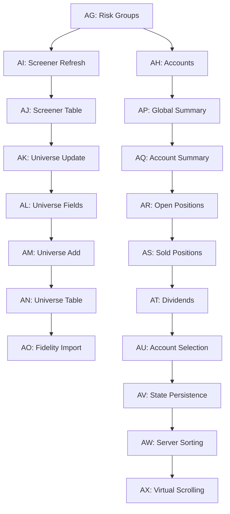

# New Epics and Stories Implementation Summary

This document summarizes the epics and stories created for the RMS-MATERIAL backend integration work.

## Overview

Created **18 new epics (AG through AX)** with associated stories to implement backend integration for the RMS-MATERIAL application. These epics systematically address the 18 items outlined in the implementation plan.

## Epic List

### Critical Path Epics (Must Complete First)

1. **Epic AG: Risk Group Data Initialization** - Ensure risk groups exist in top route
2. **Epic AH: Wire Account Panel** - Add/edit/delete accounts
3. **Epic AI: Wire Screener Refresh** - Enable screener data population
4. **Epic AJ: Wire Screener Table** - Display and edit screener data
5. **Epic AK: Wire Universe Update Button** - Sync from screener
6. **Epic AL: Wire Universe Update Fields** - Refresh prices/distributions
7. **Epic AM: Wire Universe Add Symbol** - Manual symbol addition
8. **Epic AN: Wire Universe Table Display** - Full table with editing

### Feature Completion Epics

9. **Epic AO: Fidelity Transaction Import** - Import from CSV
10. **Epic AP: Wire Global Summary** - All-accounts pie chart
11. **Epic AQ: Wire Account Summary** - Account-specific pie chart
12. **Epic AR: Wire Open Positions** - Trading positions management
13. **Epic AS: Wire Sold Positions** - Closed positions display
14. **Epic AT: Wire Dividends & Deposits** - Dividend management

### Integration & Polish Epics

15. **Epic AU: Account Selection Updates** - Cross-screen account sync
16. **Epic AV: Persist Selected Button** - State persistence on refresh
17. **Epic AW: Server-Side Sorting** - Move sorting to backend
18. **Epic AX: Virtual Scrolling** - Performance optimization

## Story Creation Status

### Fully Detailed Stories

- **AG.1** - Integrate risk group validation into top route (COMPLETE with TDD approach)
- **AH.1** - Wire account list to backend via SmartNgRX (COMPLETE with TDD approach)

### Epic-Level Stories (Outlined)

All other epics (AH.2-AX.10) have story outlines within their epic files. These need to be expanded into full story documents following the template established in AG.1 and AH.1.

## Story Template Pattern

Each story should include:

1. **Story** section with user story format
2. **Context** section explaining current state and problem
3. **Acceptance Criteria** with functional and technical requirements
4. **Test-Driven Development Approach** with 5 steps:
   - Step 1: Create unit tests first
   - Step 2: Run tests (should fail)
   - Step 3: Implement
   - Step 4: Run tests (should pass)
   - Step 5: Manual testing with Playwright
5. **Technical Approach** with implementation details
6. **Files Modified** table
7. **Definition of Done** checklist
8. **Notes** section

## Next Steps

### Immediate Actions Required

1. **Rename Old Epic AG**: Move `docs/backlog/epic-ag-testing-polish-validation.md` to a later letter (e.g., `epic-ay-testing-polish-validation.md`)

2. **Update Story References**: Any stories referencing the old AG epic need their IDs updated

3. **Create Detailed Stories**: Expand story outlines in epics into full story documents:
   - Start with critical path (AG, AH, AI, AJ, AK, AL, AM, AN)
   - Then feature completion (AO, AP, AQ, AR, AS, AT)
   - Finally integration & polish (AU, AV, AW, AX)

4. **Story Sizing**: Break down any stories that seem too large. Key criteria:
   - Can DEV complete without losing track?
   - TDD unit tests AND implementation in same story?
   - E2E tests can be separate story if needed (must immediately follow)

### Development Sequence

Follow the epic order for implementation:

```
AG → AH → AI → AJ → AK → AL → AM → AN → AO → AP → AQ → AR → AS → AT → AU → AV → AW → AX
```

Within each epic, complete stories sequentially. Do not start next epic until current epic's Definition of Done is met.

## Testing Strategy

### Unit Testing
- **CRITICAL**: Write unit tests BEFORE implementation code
- Tests must be in same story as implementation
- Follow TDD red-green-refactor cycle

### E2E Testing
- Can be separate story if it makes story more manageable
- E2E story must immediately follow implementation story
- Use Playwright MCP to verify no console errors and correct visual appearance

### Test Commands

```bash
# Run all unit tests
pnpm nx test rms-material

# Run all e2e tests  
pnpm nx e2e rms-material-e2e

# Run all tests (unit + e2e + lint)
pnpm all
```

## Key Decisions & Constraints

1. **TDD Mandatory**: All stories must follow test-driven development
2. **Story Size**: Keep small enough DEV doesn't lose track
3. **E2E Flexibility**: Can split e2e tests into separate story if needed
4. **Reference RMS App**: Use existing RMS app as reference for all functionality
5. **SmartNgRX Patterns**: Follow existing signal and effect patterns
6. **Material Design**: Match Material Design patterns from migrated components

## Files Created

### Epics
- `docs/backlog/epic-ag-risk-group-data-initialization.md`
- `docs/backlog/epic-ah-wire-account-panel.md`
- `docs/backlog/epic-ai-wire-screener-refresh.md`
- `docs/backlog/epic-aj-wire-screener-table.md`
- `docs/backlog/epic-ak-wire-universe-update-button.md`
- `docs/backlog/epic-al-wire-universe-update-fields.md`
- `docs/backlog/epic-am-wire-universe-add-button.md`
- `docs/backlog/epic-an-wire-universe-table-display.md`
- `docs/backlog/epic-ao-import-fidelity-transactions.md`
- `docs/backlog/epic-ap-wire-global-summary.md`
- `docs/backlog/epic-aq-wire-account-summary.md`
- `docs/backlog/epic-ar-wire-open-positions.md`
- `docs/backlog/epic-as-wire-sold-positions.md`
- `docs/backlog/epic-at-wire-dividends-deposits.md`
- `docs/backlog/epic-au-account-selection-persistence.md`
- `docs/backlog/epic-av-persist-selected-button.md`
- `docs/backlog/epic-aw-server-side-sorting.md`
- `docs/backlog/epic-ax-virtual-scrolling.md`

### Stories
- `docs/stories/AG.1.integrate-risk-group-validation-top-route.md`
- `docs/stories/AH.1.wire-account-list-to-backend.md`

## Epic Dependencies



## Success Criteria

The implementation is complete when:

1. All 18 epics are complete with their Definition of Done checked off
2. All unit tests pass
3. All e2e tests pass
4. RMS-MATERIAL app has feature parity with RMS app for implemented screens
5. No console errors when using the application
6. UI closely matches RMS app appearance and behavior
7. All linting passes
8. Performance is acceptable (before virtual scrolling optimization)

## Questions for PM/PO

Before proceeding with detailed story creation:

1. Should we create ALL detailed stories now, or create them just-in-time as we complete epics?
2. Any specific sizing guidance for stories beyond "small enough to track"?
3. Priority adjustments needed for any epics?
4. Any additional cross-cutting concerns to address?

---

**Document Created**: December 25, 2025
**Created By**: John (Product Manager)
**Status**: Epics created, detailed stories in progress
