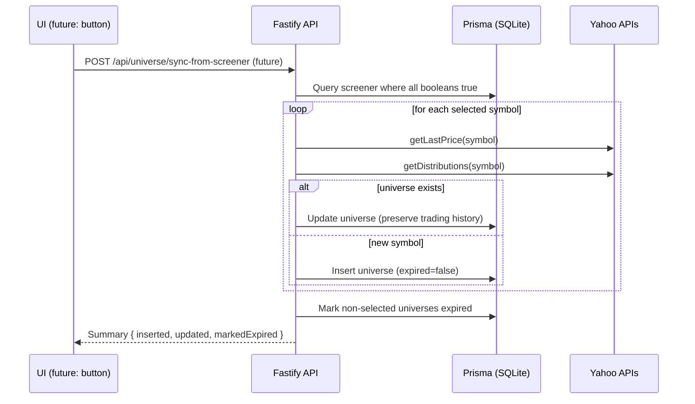

# Architecture

This document describes the end‑to‑end flow for the CEF universe feature and
proposes the change required by the PRD to populate the universe from the
Screener. It covers data model, backend APIs, frontend touch points, sequencing,
testing, deployment, and rollback.

## Context & scope

- Project type: Brownfield with UI (Angular 20 + PrimeNG + Tailwind)
- Backend: Fastify + Prisma (SQLite)
- Goal: Replace manual symbol entry with a flow that derives the tradable
  Universe from the curated Screener results where three booleans are true.

## Domain model (Prisma snapshot)

- `risk_group` (id, name)
- `screener` (id, symbol unique, risk_group_id, booleans, distribution fields)
- `universe` (id, symbol, risk_group_id, distribution fields, expired flag)
- `trades` (tied to `universe` and `accounts`)

See `prisma/schema.prisma` for the full schema.

## Current data flow (as‑is)

1) Screener refresh and curation
   - GET `/api/screener` scrapes + filters and upserts `screener` entries.
     Source: `apps/server/src/app/routes/screener/index.ts`.
   - POST `/api/screener/rows` returns selected screener rows by ids.
   - PUT `/api/screener/rows` updates booleans on a screener row.

2) Manual universe management
   - UI dialog allows pasting symbols per risk group and triggers:
     - POST `/api/settings` to upsert `universe`, mark non‑listed symbols
       as `expired=true`.
       Source: `routes/settings/index.ts`.
     - GET `/api/settings/update` refreshes prices/distributions for all
       universes.

3) Universe read & trading consumers
   - Universe CRUD:
     - POST `/api/universe` (load by ids)
     - POST `/api/universe/add`
     - PUT `/api/universe`
     - DELETE `/api/universe/:id`
     Source: `routes/universe/index.ts`.
   - Frontend consumes Universe via `UniverseEffectsService` and renders/sorts
     via `UniverseDataService`.

Limitations: Manual symbol entry is the source of truth. Screener curation is
not used to drive Universe.

## Proposed change (to‑be)

Create a backend sync that derives Universe from curated Screener.

### Selection criteria

Use all `screener` rows where these are true:

- `has_volitility`
- `objectives_understood`
- `graph_higher_before_2008`

For each selected row:

- Ensure `risk_group_id` is set (already populated in Screener flow).
- Upsert into `universe` with fields:
  - `symbol`, `risk_group_id`
  - `distribution`, `distributions_per_year`, `ex_date`
    - Prefer values from Yahoo via `getDistributions(symbol)` to keep
      consistency with existing Universe flows (`settings` routes).
  - `last_price` via `getLastPrice(symbol)`
  - Reset `most_recent_sell_date` only for new inserts; do not reset for
    existing rows to preserve trading history.
  - Set `expired=false`.

Non‑selected symbols handling:

- Mark any `universe.symbol` not in the selected Screener set as `expired=true`.
- Do not delete; keep for history.

### New API

- POST `/api/universe/sync-from-screener`
  - Body: none.
  - Behavior: Implements the selection criteria, upserts the Universe, marks
    non‑selected as expired, returns summary.
  - Idempotent: Running multiple times yields the same result.
  - Feature flag: Only active when `USE_SCREENER_FOR_UNIVERSE=true`.

### Frontend changes

- `UniverseSettingsComponent` dialog:
  - Keep current controls for manual entry (as fallback).
  - Add a button "Use Screener" that calls the new POST endpoint.
  - After completion, close dialog and refresh relevant stores.

No changes to Universe read paths are required; consumers already read
`expired` and other fields.

## Error handling & edge cases

- Missing `risk_group` rows: ensure via existing `ensureRiskGroupsExist()`.
- Distribution unavailable: upsert with existing values; do not block sync.
- Network failures to Yahoo: retry/backoff similar to current flows; partial
  updates allowed, and a later `settings/update` call can catch up.
- Concurrency: wrap upserts and mark‑expired in a transaction.

## Testing plan

- Unit
  - Selector that builds the set of eligible Screener ids.
  - Upsert function maps fields correctly and preserves history.
  - Expire function only marks symbols not present.

- Integration (server)
  - Seed `risk_group`, `screener`, `universe` records, run sync, assert
    upserted rows and expirations. Re‑run to verify idempotency.

- E2E (UI)
  - Button triggers POST, dialog progress indicator shows, stores refresh.

## Deployment & configuration

- Env
  - `DATABASE_URL` (existing)
  - `USE_SCREENER_FOR_UNIVERSE` (new)

- Scheduling
  - Run GET `/api/screener` on a schedule (e.g., daily) to refresh sources.
  - The user can invoke the sync on demand from the UI.

## Rollout & rollback

- Default off behind `USE_SCREENER_FOR_UNIVERSE=false`.
- Enable in non‑prod, validate parity with current manual list.
- Enable in prod; keep manual path as fallback.
- Rollback by toggling the flag off.

## Implementation sequence

1) Server: implement POST `/api/universe/sync-from-screener`.
2) UI: add "Use Screener" button and service call.
3) Tests: unit + integration.
4) Optional: job to schedule Screener refresh.

## References (source of truth)

- Prisma schema: `prisma/schema.prisma`
- Screener refresh: `routes/screener/index.ts`
- Screener rows: `routes/screener/rows/index.ts`
- Universe CRUD: `routes/universe/index.ts`
- Settings (manual universe): `routes/settings/index.ts`
- Settings/update (refresh): `routes/settings/update/index.ts`
- Frontend consumers:
  - `apps/rms/src/app/store/universe/universe-effect.service.ts`
  - `apps/rms/src/app/global/global-universe/universe-data.service.ts`
  - `apps/rms/src/app/universe-settings/*`

## Acceptance criteria

- Triggering the sync (spec) updates `universe` by selecting all `screener`
  rows with the three booleans set to true.
- Existing `universe` rows for selected symbols are updated (fields from
  Yahoo) but keep historical trading data; non‑selected rows are marked
  `expired=true` and are not deleted.
- Operation is idempotent; re‑running produces no change if inputs unchanged.
- Feature is disabled by default and is enabled only via
  `USE_SCREENER_FOR_UNIVERSE=true`.
- Manual universe entry remains available and unchanged.

## Sequence (sync-from-screener)

