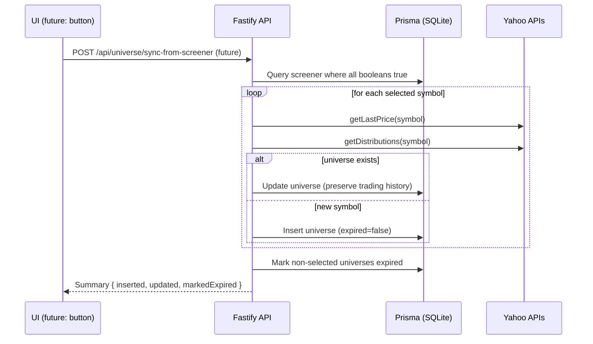

# Sequence (sync-from-screener)

```mermaid
sequenceDiagram
  participant UI as UI (future: button)
  participant API as Fastify API
  participant DB as Prisma (SQLite)
  participant Yahoo as Yahoo APIs

  UI->>API: POST /api/universe/sync-from-screener (future)
  API->>DB: Query screener where all booleans true
  loop for each selected symbol
    API->>Yahoo: getLastPrice(symbol)
    API->>Yahoo: getDistributions(symbol)
    alt universe exists
      API->>DB: Update universe (preserve trading history)
    else new symbol
      API->>DB: Insert universe (expired=false)
    end
  end
  API->>DB: Mark non-selected universes expired
  API-->>UI: Summary { inserted, updated, markedExpired }
```
