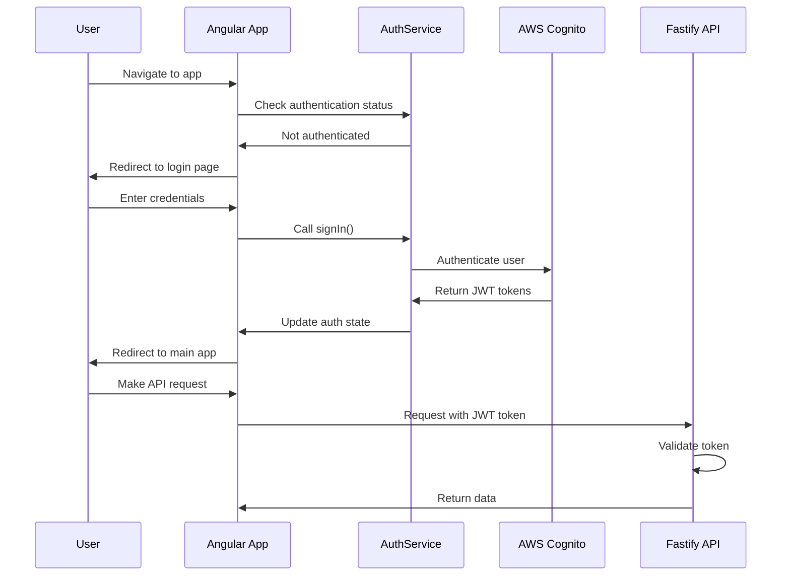
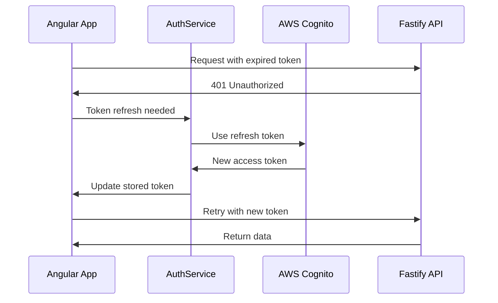
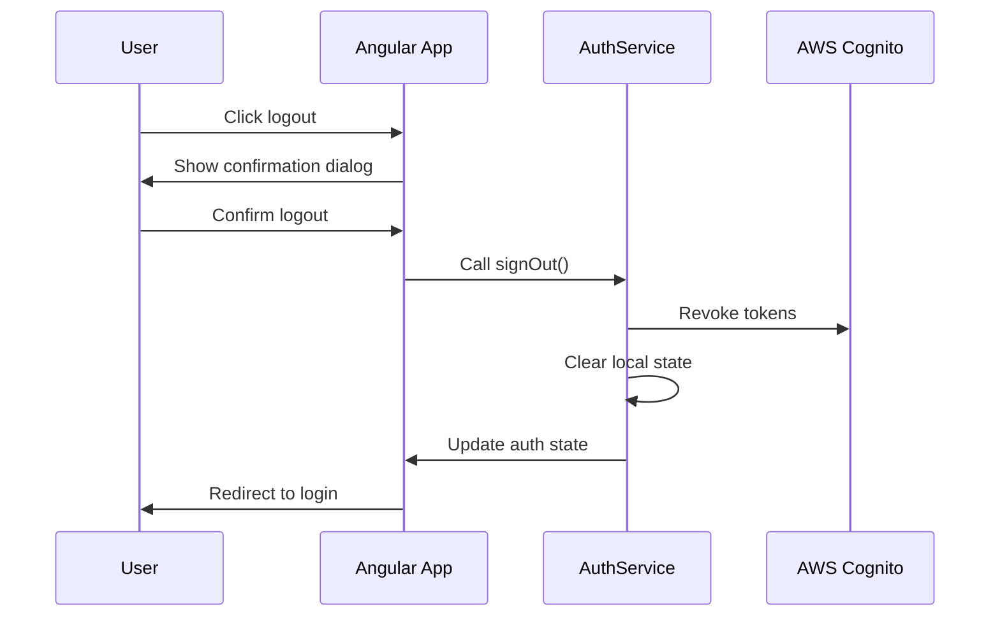

# RMS Authentication Architecture

## Table of Contents

1. [Architecture Overview](#architecture-overview)
2. [System Components](#system-components)
3. [Authentication Flow](#authentication-flow)
4. [Security Implementation](#security-implementation)
5. [API Integration](#api-integration)
6. [Token Management](#token-management)
7. [Configuration](#configuration)
8. [Monitoring and Logging](#monitoring-and-logging)

## Architecture Overview

The RMS application implements a comprehensive authentication system using AWS Cognito as the identity provider, with a multi-layered security approach that includes frontend Angular components, backend Fastify middleware, and secure token management.

### High-Level Architecture

```
┌─────────────────┐    ┌──────────────────┐    ┌─────────────────┐
│   Angular SPA   │    │   Fastify API    │    │   AWS Cognito   │
│                 │    │                  │    │                 │
│ ┌─────────────┐ │    │ ┌──────────────┐ │    │ ┌─────────────┐ │
│ │ AuthService │◄├────┤►│ Auth         │◄├────┤►│ User Pool   │ │
│ │             │ │    │ │ Middleware   │ │    │ │             │ │
│ └─────────────┘ │    │ └──────────────┘ │    │ └─────────────┘ │
│                 │    │                  │    │                 │
│ ┌─────────────┐ │    │ ┌──────────────┐ │    │ ┌─────────────┐ │
│ │ AuthGuard   │ │    │ │ Rate         │ │    │ │ App Client  │ │
│ │             │ │    │ │ Limiting     │ │    │ │             │ │
│ └─────────────┘ │    │ └──────────────┘ │    │ └─────────────┘ │
│                 │    │                  │    │                 │
│ ┌─────────────┐ │    │ ┌──────────────┐ │    │ ┌─────────────┐ │
│ │ HTTP        │ │    │ │ Security     │ │    │ │ JWT Tokens  │ │
│ │ Interceptor │ │    │ │ Headers      │ │    │ │             │ │
│ └─────────────┘ │    │ └──────────────┘ │    │ └─────────────┘ │
└─────────────────┘    └──────────────────┘    └─────────────────┘
```

### Key Design Principles

- **Zero Trust Architecture**: Every request is verified regardless of source
- **Defense in Depth**: Multiple layers of security controls
- **Principle of Least Privilege**: Users have minimal necessary permissions
- **Secure by Default**: Security controls are enabled by default
- **Compliance Ready**: Designed to meet enterprise security standards

## System Components

### Frontend Components (Angular 20)

#### AuthService (`/src/app/auth/auth.service.ts`)

**Responsibilities:**

- Manages authentication state using Angular signals
- Handles login/logout operations with AWS Cognito
- Manages token storage and refresh
- Provides reactive authentication status

**Key Features:**

- Signal-based reactive state management
- Automatic token refresh
- Remember me functionality
- Error handling and recovery

```typescript
// Key service methods
signIn(credentials: LoginFormData): Promise<void>
signInWithRememberMe(email: string, password: string): Promise<void>
signOut(): Promise<void>
isAuthenticated(): Signal<boolean>
currentUser(): Signal<User | null>
```

#### AuthGuard (`/src/app/auth/guards/auth.guard.ts`)

**Responsibilities:**

- Protects routes from unauthenticated access
- Redirects unauthenticated users to login
- Preserves intended destination for post-login redirect

**Implementation:**

- Functional guard using Angular's latest patterns
- Reactive authentication status checking
- Automatic return URL handling

#### HTTP Interceptor (`/src/app/auth/interceptors/auth.interceptor.ts`)

**Responsibilities:**

- Automatically adds JWT tokens to API requests
- Handles token refresh on 401 responses
- Manages authentication headers

**Security Features:**

- Secure token attachment
- Automatic retry with refreshed tokens
- Request queue management during refresh

### Backend Components (Fastify)

#### Authentication Middleware (`/src/middleware/auth.middleware.ts`)

**Responsibilities:**

- Validates JWT tokens on all API requests
- Verifies token signature and expiration
- Extracts user context from tokens

**Security Implementation:**

- JWT signature verification using AWS Cognito public keys
- Token expiration validation
- Rate limiting integration
- Request logging for security monitoring

#### Rate Limiting (`/src/middleware/rate-limit.middleware.ts`)

**Responsibilities:**

- Prevents brute force attacks
- Limits authentication attempts per IP
- Implements sliding window rate limiting

**Configuration:**

- Authentication endpoints: 5 attempts per 15 minutes
- API endpoints: 100 requests per minute per user
- Progressive delays for repeated failures

#### Security Headers Middleware

**Implemented Headers:**

- Content Security Policy (CSP)
- HTTP Strict Transport Security (HSTS)
- X-Frame-Options
- X-Content-Type-Options
- Referrer-Policy

### AWS Cognito Configuration

#### User Pool Settings

**Authentication Flow:**

- USER_SRP_AUTH: Secure Remote Password protocol
- ALLOW_REFRESH_TOKEN_AUTH: Token refresh capability
- Password policy enforcement
- Account lockout protection

**Security Features:**

- Multi-factor authentication ready
- Password complexity requirements
- Account recovery mechanisms
- Audit logging

#### App Client Configuration

**Settings:**

- Client secret not required (SPA application)
- OAuth 2.0 flows: Authorization code grant
- Token expiration: Access tokens (1 hour), Refresh tokens (90 days)
- Callback URLs configured for application domains

## Authentication Flow

### Standard Login Flow



### Token Refresh Flow



### Logout Flow



## Security Implementation

### Token Security

#### Storage Mechanism

- **Access Tokens**: Stored in session storage (automatic cleanup)
- **Refresh Tokens**: Stored in HTTP-only cookies (XSS protection)
- **User Data**: Stored in memory signals (cleared on logout)

#### Token Validation

- **Signature Verification**: Using AWS Cognito public keys
- **Expiration Checking**: Automatic validation on each request
- **Audience Validation**: Ensures tokens are for correct application
- **Issuer Validation**: Verifies tokens from trusted Cognito pool

### CSRF Protection

**Implementation:**

- Double-submit cookie pattern
- CSRF tokens for state-changing operations
- SameSite cookie attributes
- Origin header validation

### Content Security Policy

```http
Content-Security-Policy:
  default-src 'self';
  script-src 'self' 'unsafe-inline' *.amazonaws.com;
  style-src 'self' 'unsafe-inline';
  img-src 'self' data: *.amazonaws.com;
  connect-src 'self' *.amazonaws.com;
  font-src 'self';
  object-src 'none';
  base-uri 'self';
  form-action 'self';
```

### Session Security

**Features:**

- Session fixation protection
- Automatic session regeneration on login
- Secure session timeout handling
- Session invalidation on logout

## API Integration

### Authentication Headers

All API requests include:

```http
Authorization: Bearer <jwt-access-token>
Content-Type: application/json
X-Requested-With: XMLHttpRequest
```

### Error Handling

**HTTP Status Codes:**

- `401 Unauthorized`: Invalid or expired token
- `403 Forbidden`: Valid token but insufficient permissions
- `429 Too Many Requests`: Rate limit exceeded
- `500 Internal Server Error`: Server-side authentication error

**Client Response:**

- Automatic token refresh on 401
- User notification on 403
- Rate limit handling on 429
- Error logging and reporting

### API Endpoint Protection

**Protected Routes:**

- All `/api/*` endpoints require authentication
- User context available in request object
- Permission-based access control

**Public Routes:**

- `/health` - Health check endpoint
- `/api/auth/login` - Authentication endpoint
- Static assets and documentation

## Token Management

### Token Lifecycle

#### Access Tokens

- **Lifespan**: 1 hour
- **Purpose**: API access authorization
- **Storage**: Session storage
- **Refresh**: Automatic when near expiration

#### Refresh Tokens

- **Lifespan**: 90 days (configurable)
- **Purpose**: Obtain new access tokens
- **Storage**: HTTP-only cookies
- **Rotation**: New refresh token issued on use

#### ID Tokens

- **Lifespan**: 1 hour
- **Purpose**: User identity information
- **Storage**: Memory only
- **Contains**: User profile data, groups, custom attributes

### Token Refresh Strategy

**Proactive Refresh:**

- Tokens refreshed 5 minutes before expiration
- Background refresh while user is active
- Seamless user experience without interruption

**Failure Handling:**

- Automatic logout on refresh failure
- Clear error messaging to user
- Secure cleanup of expired tokens

## Configuration

### Environment Configuration

#### Development Environment

```typescript
export const environment = {
  production: false,
  cognito: {
    userPoolId: 'us-east-1_XXXXXXXXX',
    userPoolWebClientId: 'xxxxxxxxxxxxxxxxxxxxxxxxxx',
    region: 'us-east-1',
    domain: 'rms-dev.auth.us-east-1.amazoncognito.com',
  },
  api: {
    baseUrl: 'http://localhost:3000',
    timeout: 30000,
  },
};
```

#### Production Environment

```typescript
export const environment = {
  production: true,
  cognito: {
    userPoolId: 'us-east-1_YYYYYYYYY',
    userPoolWebClientId: 'yyyyyyyyyyyyyyyyyyyyyyyyyy',
    region: 'us-east-1',
    domain: 'rms-prod.auth.us-east-1.amazoncognito.com',
  },
  api: {
    baseUrl: 'https://api.rms.company.com',
    timeout: 30000,
  },
};
```

### Security Configuration

#### CORS Settings

```typescript
const corsOptions = {
  origin: ['https://rms.company.com', 'https://rms-staging.company.com'],
  credentials: true,
  methods: ['GET', 'POST', 'PUT', 'DELETE', 'OPTIONS'],
  allowedHeaders: ['Content-Type', 'Authorization', 'X-Requested-With'],
};
```

#### Rate Limiting Configuration

```typescript
const rateLimitConfig = {
  windowMs: 15 * 60 * 1000, // 15 minutes
  max: 5, // 5 attempts per window
  message: 'Too many authentication attempts',
  standardHeaders: true,
  legacyHeaders: false,
};
```

## Monitoring and Logging

### Authentication Events

**Logged Events:**

- Successful login attempts
- Failed login attempts
- Token refresh operations
- Logout events
- Account lockouts
- Security policy violations

**Log Format:**

```json
{
  "timestamp": "2024-01-15T10:30:00.000Z",
  "event": "auth.login.success",
  "userId": "user123",
  "ip": "192.168.1.100",
  "userAgent": "Mozilla/5.0...",
  "sessionId": "sess_abc123",
  "metadata": {
    "rememberMe": true,
    "mfaUsed": false
  }
}
```

### Security Monitoring

**Metrics Tracked:**

- Authentication success/failure rates
- Token refresh frequency
- Session duration statistics
- Rate limit violations
- Security header compliance

**Alerting Thresholds:**

- Failed login rate > 10% over 5 minutes
- Unusual geographic login patterns
- Token validation failures > 5% over 1 minute
- Rate limit violations > 100 per hour

### Performance Monitoring

**Authentication Performance Metrics:**

- Login response time (target: < 2 seconds)
- Token refresh time (target: < 500ms)
- API request latency with auth (target: < 200ms overhead)
- Session validation time (target: < 100ms)

**Health Checks:**

- Cognito service availability
- Token validation service status
- Rate limiting service health
- Database connectivity for audit logs

## Disaster Recovery

### Backup and Recovery

**Authentication Data:**

- User pool configuration backed up daily
- App client settings versioned in code
- Audit logs retained for 90 days
- Configuration snapshots stored in S3

**Recovery Procedures:**

- Cognito service outage: Graceful degradation mode
- Token service failure: Emergency authentication bypass
- Database failure: Read-only mode with cached tokens
- Complete system failure: Recovery from configuration backups

### Business Continuity

**Service Degradation Modes:**

1. **Full Service**: All authentication features available
2. **Limited Service**: Basic login only, no token refresh
3. **Emergency Mode**: Administrator override access only
4. **Maintenance Mode**: Authentication disabled, read-only access

---

_This architecture documentation is maintained as part of the RMS authentication system implementation and should be reviewed quarterly for accuracy and completeness._
